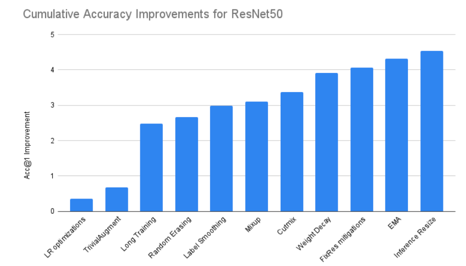
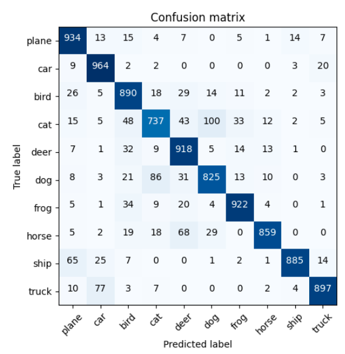
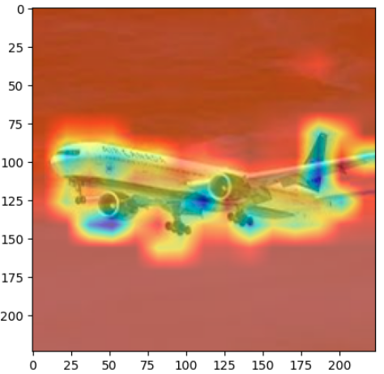
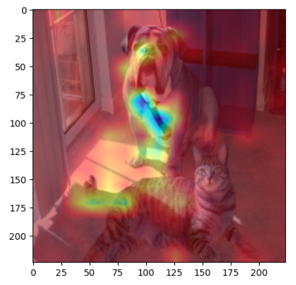

# vit_cifar10
vit cifar10 test with image size 32, 64

### vit test result with patch size 32

acc : 83.6

https://github.com/YuBeomGon/vit_cifar10/blob/master/notebooks/vit-scratch-s4.ipynb

***

### vit test result with patch size 32, v2 training

regard v2, 

https://pytorch.org/blog/how-to-train-state-of-the-art-models-using-torchvision-latest-primitives/

acc : 88.0

https://github.com/YuBeomGon/vit_cifar10/blob/master/notebooks/vit-scratch-v2.ipynb

***

### vit fine tune to img_size 64

acc : 89.1

https://github.com/YuBeomGon/vit_cifar10/blob/master/notebooks/vit-64-from-32.ipynb

confusion matrix

attn map visualize

***
checkpoint

1. image resolution is important. accuracy is 70.0 in original setting,
   so add overraping patch embeding for efficient attention training
2. add lots of augmentation, normalization(q,k,v norm), because dataset is small, and vit has low inductive bias
3. weight init is not good in cifar10 case, default init is used.
4. use patch embeding interpolation for image_size 64 fine tuning

***
further

1. Use RoRA, adapter like big model fine tuning scheme
2. Deit, knowledge distillation(from big model to tiny model knowledge transfer)
3. use layer scale(cait)

